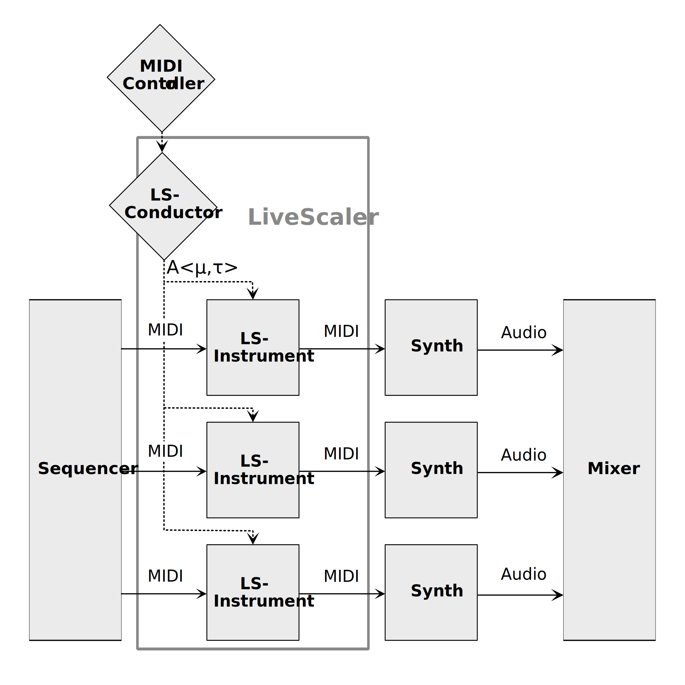

# LiveScaler

LiveScaler allows to change in live the scale of all the MIDI tracks of a session at the same time. 

For now, LiveScaler only works within Ableton Live. It is composed of two Max For Live devices : 
* **LiveScaler-Conductor** : receives MIDI from a controller to generate scale transformations that are sent to all the LiveScaler-Instrument
* **LiveScaler-Instrument** : applies the scale transformations received from LiveScaler-Conductor to the MIDI it receives

## Quick set-up

To set up a LiveScaler session in Ableton Live : 

* Create a MIDI track dedicated to a unique instance of LiveScaler-Conductor. This is the track you need to send MIDI to in order to control LiveScaler with a controler.
* For each MIDI track you wish to apply the scale transformation, add a LiveScaler-Instrument instance. It will automatically receive transformation from the Conductor.

To check if it works properly, send a transformation from the Conductor (e.g. by playing with the **Transp** parameter), the Instrument instance should flash to show they received it and should apply the MIDI transform at the same time (e.g. transpose all the tracks with a LiveScaler-Instrument instance on it).

## Operator's manual

An operator's manual can be found on LiveScaler's wiki on  Github : [Operator's Manual](https://github.com/autonym8/LiveScaler/wiki/Home)

## Research article

LiveScaler will be presented at Journée d'Informatique Musicales 2023 in Paris.

## Architecture of LiveScaler

* LiveScaler-Conductor has an unique instance on a separate MIDI track.
* There's a LiveScaler-Instrument for each MIDI track which must be impacted by LiveScaler's transformations. 

